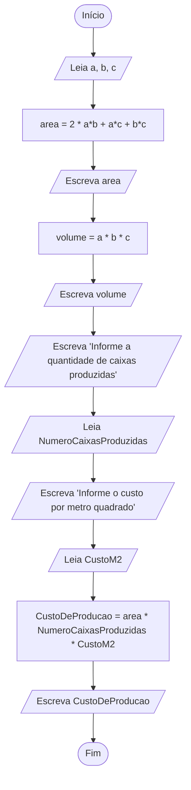

# Exercício em sala: Caixas de papelão

Considere uma fábrica que produz caixas de papelão idênticas, em formato de paralelepípedo.

a. Elabore um fluxograma e um pseudocódigo para um algoritmo que Lê três números reais representando as dimensões de uma caixa (em m) e ESCREVE a área da superfície (em m2) e o volume da caixa (em m3).

b. Modifique o item anterior de modo que, além das dimensões, também sejam LIDOS um número inteiro representando a quantidade de caixas produzidas e um número real representando o custo do metro quadrado (em R$/m2) e seja ESCRITO o custo total de produção das caixas (em R$).

c. Execute um teste de mesa para o algoritmo completo, com a entrada 0.5 0.3 0.3 10 3.50; a saída deve ser 0.78 0.045 27.3.

## Resolução

### Fluxograma



- [Link para Fluxograma no fluxolab](https://fluxolab.app/?lzs=NoIhBplBnCAYC6kQEMBOBTF8mm+RZAIx2QGNTQA3AewBsBXAWw0pADlmM0aBhFAJYAPFNAAKPACYMAXgMmi2vBtAAuNACIYJNaWRQ0lK9QFkATDlzA44AMzgzADhsBGODbDEaq9UxAJcF3AAFgdncBdw1HAAAiJYii8fGj8AyHsANjCbMwyPdCwAXjMAKgAKFBKiAGpKsmqiErIASghQIm9ff1xQgFYQvLszfMx8ds6U7sh+xztBgE5h8E9gNOAzcCynG1so2kYWQsrGxPHk1Nws-uDgmxuPfa42kA7zqeAAdhC5m16ozhYPH4wlEOmkcgUsCSXTWs36tkGvSWIAAOiAAJIAOwAZjQ0CwYigYgBHBgoTGqeQoSQYGI0mL6EHQGIAByksip0DRz1eMNw83A8MGGUGqIxOLxBJoDOM0pZeJiLFUPBJZMkaGpNG50Mmazc3wRNg+t2WyjUNHMPImF0gLiCWUN4GcHjN6i0YIY+hoR1GJQB3D4ghE4nZENEJVdFosOptwBcGyFNkcosj7vZXqtbwCVlcrlw9n1wUCER2PRLDlwG31GUu5ccuFm+o+uC++vm-PLbkCuYiLkCQX18cCVd+2aAA)

### Pseudocódigo

Com base no fluxograma que você enviou, aqui está o pseudocódigo estruturado. Note que utilizei a fórmula da área total de um paralelepípedo conforme indicado na imagem.

```Delphi
Algoritmo "Calculo_Producao_Caixas"

Var
   // Dimensões e cálculos básicos
   a, b, c, area, volume : Real
   
   // Dados de produção
   NumeroCaixasProduzidas : Inteiro
   CustoM2, CustoDeProducao : Real

Inicio
   // Entrada das dimensões
   Escreva("Digite os valores de a, b e c: ")
   Leia(a, b, c)

   // Cálculo da área total e exibição
   // Fórmula: 2 * (ab + ac + bc)
   area <- 2 * (a * b + a * c + b * c)
   Escreval("Área: ", area)

   // Cálculo do volume e exibição
   volume <- a * b * c
   Escreval("Volume: ", volume)

   // Entrada de dados da produção
   Escreval("Informe a quantidade de caixas produzidas: ")
   Leia(NumeroCaixasProduzidas)

   Escreval("Informe o custo por metro quadrado: ")
   Leia(CustoM2)

   // Cálculo do custo total de produção
   CustoDeProducao <- area * NumeroCaixasProduzidas * CustoM2

   // Resultado final
   Escreval("Custo de Produção Total: ", CustoDeProducao)

Fimalgoritmo
```

### Teste de mesa

Entrada: 0.5 0.3 0.3 10 3.50
Saída: 0.78 0.045 27.3.
<sub>
|Bloco|Instrução|a|b|c|area|volume|numeroCaixasProduzidas|custoM2|custoProducao|Entrada|Saida|
|:---:|:---:|:---:|:---:|:---:|:---:|:---:|:---:|:---:|:---:|:---:|:---:|
|0|Início|0|0|0|0|0|0|0|0|0|0|
|1|Leia|0.5|0.3|0.3|0|0|0|0|0|0.5 0.3 0.3|0|
|2|Atribuição|0.5|0.3|0.3|0.78|0|0|0|0|0|0|
|3|Escreva|0.5|0.3|0.3|0.78|0|0|0|0|0|0.78|
|4|Atribuição|0.5|0.3|0.3|0.78|0.045|0|0|0|0|0|
|5|Escreva|0.5|0.3|0.3|0.78|0.045|0|0|0|0|0.045|
|6|Escreva|0.5|0.3|0.3|0.78|0.045|0|0|0|0|"Informe a quantidade de caixas produzidas"|
|7|Leia|0.5|0.3|0.3|0.78|0.045|10|0|0|10|0|
|8|Escreva|0.5|0.3|0.3|0.78|0.045|10|0|0|"Informe o custo por metro quadrado"|0|
|9|Leia|0.5|0.3|0.3|0.78|0.045|10|3.5|0|3.5|0|
|10|Atribuição|0.5|0.3|0.3|0.78|0.045|10|3.5|27.3|0|0|
|11|Escreva|0.5|0.3|0.3|0.78|0.045|10|3.5|27.3|0|27.3|
|12|Fim|0.5|0.3|0.3|0.78|0.045|10|3.5|27.3|0|0|
</sub>
### Java

```java
import java.util.Scanner;

public class CaixasDePapelao {

    public static void main(String[] args) {
        double area = 0;
        double volume = 0;

        Scanner scanner = new Scanner(System.in);
        System.out.print("Informe as três dimensões da caixa de papelão (comprimento, largura e altura): ");
        double comprimento = scanner.nextDouble();
        double largura = scanner.nextDouble();
        double altura = scanner.nextDouble();

        area = 2* (comprimento * largura + comprimento * altura + largura * altura);
        volume = comprimento * largura * altura;

        System.out.println("Área da caixa: " + area);
        System.out.println("Volume da caixa: " + volume);

        System.out.println("Informe um número inteiro representando a quantidade de caixas produzidas");
        int quantidade = scanner.nextInt();

        System.out.println("Informe um número real representando o custo do metro quadrado");
        double custo = scanner.nextDouble();

        System.out.printf("Custo total: %.2f%n", (area * quantidade * custo));
    }
}
```
