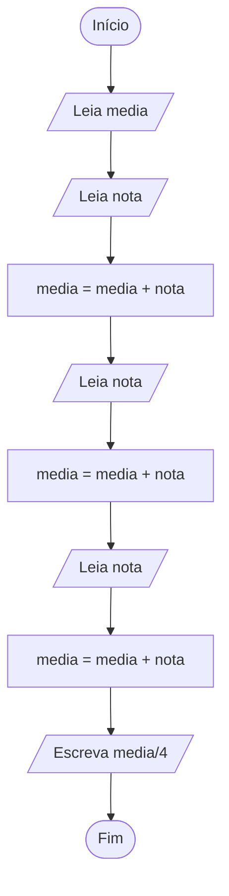

# Media das notas

Elabore um fluxograma para um algoritmo que LÊ quatro número reais representando as notas de um aluno e ESCREVE a média aritmética simples destas notas. Utilize apenas duas variáveis. Em seguida, execute um teste de mesa com a entrada 7.5 8.0 5.5 9.0; a saída deve ser 7.5.

## Fluxograma



## Pseudocódigo

```pseudocódigo
Variáveis
    nota, media: Número real (double)
Início
    media = 0
    Leia nota
    media = media + nota
    Leia nota
    media = media + nota
    Leia nota
    media = media + nota
    Leia nota
    media = media + nota
    Escreva media/4
Fim
```

## Teste de mesa

| Bloco | instrução | nota | media | Entrada | Saida
| :---: | :---: | :---: | :---: | :---: | :---:
| Bloco 0 | Início | 0 | 0 | 0 | 0
| Bloco 1 | Leia | 7.5 | 0 | 7.5 | 0
| Bloco 2 | Atribuição | 7.5 | 7.5 | 0 | 0
| Bloco 3 | Leia | 8.0 | 7.5 | 8 | 0
| Bloco 4 | Atribuição | 8.0 | 15.5 | 0 | 0
| Bloco 5 | Leia | 5.5 | 15.5 | 5.5 | 0
| Bloco 6 | Atribuição | 5.5 | 21 | 0 | 0
| Bloco 7 | Leia | 9.0 | 21 | 9.0 | 0
| Bloco 8 | Atribuição | 9.0 | 30 | 0 | 0
| Bloco 9 | Escreva | 9.0 | 30 | 0 | 7.5
| Bloco 10 | Fim | 9.0 | 30 | 0 | 0

## Java

```java
import java.util.Scanner;

class MediaNotas{
 public static void main(String args[]){
    double nota, media;
    System.out.println("Informe as 4 notas em números reais(ex. 1,0): ");
    try (Scanner scanner = new Scanner(System.in)){
        media = scanner.nextDouble();//Lê nota 1
        nota = scanner.nextDouble();//Lê nota 2
        media = media + nota;
        nota = scanner.nextDouble();//Lê nota 3
        media = media + nota;
        nota = scanner.nextDouble();//Lê nota 4
        media = ( media + nota )/4;
        System.out.printf("Media final: %.2f", media);
        System.out.println();
    }
 }
}
```
