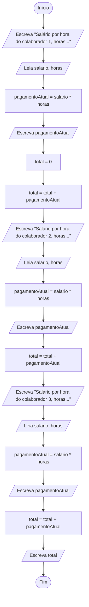

# Exercício em sala: Pagamento de colaboradores

Elabore um fluxograma e um pseudocódigo para um algoritmo que Lê os salários por hora (em R$ por hora) e as horas trabalhadas de três colaboradores de uma empresa e ESCREVE o pagamento de cada um deles, bem como o total pago pela empresa. Não utilize mais que quatro variáveis. A ordem de leitura dos dados de entrada deve ser:

```
salário por hora do colaborador 1, horas trabalhadas do colaborador 1,
salário por hora do colaborador 2, horas trabalhadas do colaborador 2,
salário por hora do colaborador 3, horas trabalhadas do colaborador 3.
```

A ordem de escrita dos dados de saída deverá ser:

```
pagamento do colaborador 1, pagamento do colaborador 2, pagamento do colaborador 3, total pago pela empresa.
```

Em seguida, execute um teste de mesa com a entrada 20 8 30 7 20 6.5; a saída deve ser 160 210 130 500.

## Resolução

### Fluxograma



- [Link para fluxolab](https://fluxolab.app/?lzs=NoIhBplBnBDAbWAnAlgewgBgLqRAB1gHNYBbAUwDsAXNAQWoFcEtdQALNJWaVvW6i3A42wTOADM4AIwAWcdIBs4sHgBGaarVIhsbaeACsM+eABMZlQB0QAZQQBD1GgAE+Li87cXAE1cBjNEQNbj8kFwNPLh4Xam41BHZYHxi-F0Dg6LCImwhQDS00HT1IRXBZE3EzAA4VOERncCjuXnVNbV02AHZwMrlxCVMCYjIqWgZmeABeeuR0ACovHjyQAo6S4GreyqNLcBABBCnD+ABqQhIKGnomIXz2os7IaXFjfplLFROVtceN6QMW3e0jMyn2eQ2Zm27y6mBUF1G1wmR1mzkW0Va90KxTYFTepnk8JGV3Gt3gPweOMgxnx4i6YOGlzGN0mFOxT2AAE5yjtOUNUegmktMatKRyQdDTC84fsESSWSiEHM0OiWmz1vopLSZJgGXLmcjyW12f8Kn1TNU9gdNEcTudiQayeq-vpjOaFO9rYJpnb9UincaNc8ytrDLV9jZ7PAnOg3B4lr4AkFYCFkh4oc0YnEU4lkqkk5lQuncoGXc8etrquGQJHHM44+EE2kMimsh4pJnoLF4rmUl3m8nU9kJCWsUHgNItu7ygyTlNMM6qcApBV3op+UrGp3F51RAoFGw+nT9PuZNJujrymxuS8PvoobfpBI2G8FLJNZfpIZ9JfFK7PzgkBAgof7PKuChdPoPS3pyuKftU+jAeACGQA+rz6EekhsFIt5mHo2BAA)

### Pseudocódigo

```delphi
Algoritmo "Calculo_Pagamento_Total"
Var
   salario, horas, pagamentoAtual, total : real

Inicio
   // Colaborador 1
   Escreva("Salário por hora do colaborador 1, horas: ")
   Leia(salario, horas)
   pagamentoAtual <- salario * horas
   Escreva("Pagamento atual: ", pagamentoAtual)
   
   total <- 0
   total <- total + pagamentoAtual
   
   // Colaborador 2
   Escreva("Salário por hora do colaborador 2, horas: ")
   Leia(salario, horas)
   pagamentoAtual <- salario * horas
   Escreva("Pagamento atual: ", pagamentoAtual)
   
   total <- total + pagamentoAtual
   
   // Colaborador 3
   Escreva("Salário por hora do colaborador 3, horas: ")
   Leia(salario, horas)
   pagamentoAtual <- salario * horas
   Escreva("Pagamento atual: ", pagamentoAtual)
   
   total <- total + pagamentoAtual
   
   // Resultado Final
   Escreva("Total acumulado: ", total)
FimAlgoritmo
```

### Java

```java
import java.util.Scanner;

class Pagamento{
    public static void main(String[] args) {
        double salario, pagamentoAtual, horas, total;
        total = 0;

        Scanner scanner = new Scanner(System.in);
        System.out.println("Salário por hora do colaborador 1, horas trabalhadas do colaborador 1");
        salario = scanner.nextDouble();
        horas = scanner.nextDouble();
        pagamentoAtual=salario*horas;
        System.out.println(pagamentoAtual);
        
        total+=pagamentoAtual;

        System.out.println("Salário por hora do colaborador 2, horas trabalhadas do colaborador 2");
        salario = scanner.nextDouble();
        horas = scanner.nextDouble();
        pagamentoAtual=salario*horas;
        System.out.println(pagamentoAtual);
        total+=pagamentoAtual;

        System.out.println("Salário por hora do colaborador 3, horas trabalhadas do colaborador 3");
        salario = scanner.nextDouble();
        horas = scanner.nextDouble();
        pagamentoAtual=salario*horas;
        System.out.println(pagamentoAtual);

        total+=pagamentoAtual;
        System.out.println("Total: "+ total);
    }
}
```