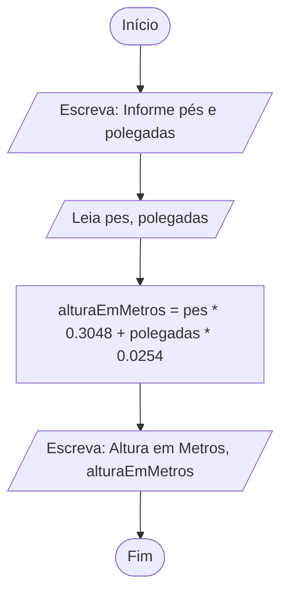
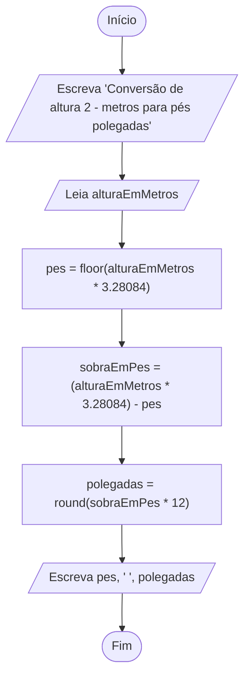

# Exercício em sala: Conversão de Altura

Nos Estados Unidos da América, a altura de uma pessoa é medida em pés + polegadas. Por exemplo, considere uma pessoa com 5 pés + 11 polegadas de altura (escrito simplesmente como 5′11′′); sabendo que 1 pé equivale a 12 polegadas, e 1 polegada equivale a 2.54 centímetros, conclui-se que tal pessoa mede 180.34 cm, ou seja, aproximadamente 1.80 m.

a. Elabore um fluxograma e um pseudocódigo para um algoritmo que Lê dois números inteiros representando os valores da altura de uma pessoa em pés + polegadas e ESCREVE o valor da altura em metros. Em seguida, execute um teste de mesa com a entrada 5 11; a saída deve ser 1.8034.

b. Elabore outro fluxograma e um pseudocódigo, agora para um algoritmo que LÊ um único valor em metros e ESCREVE os valores em pés e polegadas correspondentes. Assuma que exista uma função chamada round que arredonda um número real para o inteiro mais próximo; por exemplo, round(3.14) = 3, round(3.86) = 4 e round(5) = 5. Em seguida, execute um teste de mesa com a entrada 1.8; a saída deve ser 5 11.

## Resolução A

### Fluxograma

- [a - Link para a fluxograma no fluxolab.app](https://fluxolab.app/?lzs=NoIhBplAHBTBnCAGAupE0D2AbWBzAQwBMDFxV0BBbAFwFcAnAgUQFsBZZFNKJcAZgEAmPgEYkfMOgBGmGjUysQ3SEPABWYXyEA2SQB0QASQB2AM0wNWsAATQAl-Bu2suQiSfxY0AkyKY7Sxs6Vmd4HwBzzEMIUFl5RWUeQQAWLQEUyTh4cEC3YlJYkHiFJRVgNIAOdL1JWPLNHXSUzPAQanomNnYAXgAKAeyAKlEhAEohoQA6dRSxgGpXfAL4SZm5gHpxJCKSxPKmzX4RDRP22kYWDl25UqSeYDVxAWTwZ-UeTWedHibnlJ4Ym03BQQA)

- a - Fluxograma em Mermaid


### Pseudocódigo

```portugol

//Início
programa {
        // Declaração de Variáveis
        real pes, polegadas, alturaEmMetros

        // Entrada de Dados
        escreva("Informe os pés e as polegadas (separados por espaço): ")
        leia(pes, polegadas)

        // Processamento
        alturaEmMetros = (pes * 0.3048) + (polegadas * 0.0254)

        // Saída de Dados
        escreva("Altura em Metros: ", alturaEmMetros)
}
```

### Solução A em Java

```java
import java.util.Scanner;

public class ConversaoDeAlturaA {

    public static void main(String[] args) {
        Scanner scanner = new Scanner(System.in);
        System.out.println("Informe pés e polegadas separado por um espaço: ");
        double pes = scanner.nextDouble();
        double polegadas = scanner.nextDouble();

        double alturaEmMetros = ( ((pes * 12)*2.54) + polegadas*2.54) /100;
        System.out.printf("Altura em metros: %.2f%n", alturaEmMetros);
    }
}
```

### Teste de mesa

Entrada: 5 11
Saída: 1.80

| Bloco | pes (ft) | polegadas (in) | Altura (m) |
| :---: | :---: | :---: | :---: |
| Bloco 0 | 0 | 0 | 0 |
| Bloco 1 | 0 | 0 | 0 |
| Bloco 2 | 5 | 11 | 0 |
| Bloco 3 | 5 | 11 | 1.80 |
| Bloco 4 | 5 | 11 | 1.80 |
| Bloco 5 | 5 | 11 | 1.80 |

## Resolução B

### Fluxograma

- [b  - Link para a fluxograma no fluxolab.app](https://fluxolab.app/?lzs=NoIhBplBBAbAXArgJwIYFEC2BZApvZAewGcIAGAXUhAAddTxLqbDZcBzVAE1QadGKEARmiwAFeuQpUoZcAGZwAJgBscgIwAWOWGpDC8eIUwhpkdeACsytcqU6AOiADChAHYA3XMmIBjwgAEXLgBqAgoqAFKAQC0AZj4RMQBNKhoKQCXySxsnDzEThCg+obGpjJK4Jo2ckoAHDpwSKI4iSRFICVGJmbAiio1CtrgtPQAvABmsISEyAAUTRFYeAQkAFTyAHT1ZHWaAJQdXWW91QOqcpq2tKwc3LxjRIhuXHOCIhiYEsRr6kqHegM3XKkGs1guVnsIzoxHATgCTnAKVueV4RyBJxkAzqg0sDRGRV6AHZwOdbNodO8Wt8xgtwi0VkkNtsGnt9jEYejSj1esANBoZBZ1LUKuBhQoZNVxZYZNZxSoZIpxUSZCTxZppBQgA)

- b - Fluxograma em Mermaid


### Pseudocódigo

```portugol

//Início
programa{

    //Declaração de variáveis
    real alturaEmMetros, pes, sobraEmPes, polegadas

    //Entrada
    escreva("Informe a altura em Metros: ")
    leia(alturaEmMetros)

    //Processamento/Atribuição
    pes = floor(alturaEmMetros * 3.28084)
    sobraEmPes = (alturaEmMetros * 3.28084) - pes
    polegadas = round(sobraEmPes * 12)

    //Saída
    escreva(pes, " ", polegadas)

    //Fim
}
```

### Java

```java
import java.util.Scanner;

public class ConversaoDeAlturaB {

    public static void main(String[] args) {
        try (Scanner scanner = new Scanner(System.in)) {
            System.out.println("Informe a altura em metros: ");
            double alturaEmMetros = scanner.nextDouble();

            double pes = Math.floor(alturaEmMetros*3.28084);
            double sobraEmPes = (alturaEmMetros*3.28084) - pes;
            double polegadas = Math.round(sobraEmPes *12);

            System.out.printf("Altura pés e polegadas: %.2f %.2f%n" , pes, polegadas);
            scanner.close();
        }
    }
}
```

### Teste de mesa

Entrada: 1.8
Saída: 5 11

| Bloco | alturaEmMetros | pes | sobraEmPes | polegadas |
| :---: | :---: | :---: | :---: | :---: |
| Bloco 0 | 0 | 0 | 0 | 0 |
| Bloco 1 | 0 | 0 | 0 | 0 |
| Bloco 2 | 1.8 | 0 | 0 | 0 |
| Bloco 3 | 1.8 | 5 | 0 | 0 |
| Bloco 4 | 1.8 | 5 | 0.90 | 0 |
| Bloco 5 | 1.8 | 5 | 0.90 | 11 |
| Bloco 6 | 1.8 | 5 | 0.90 | 11 |

