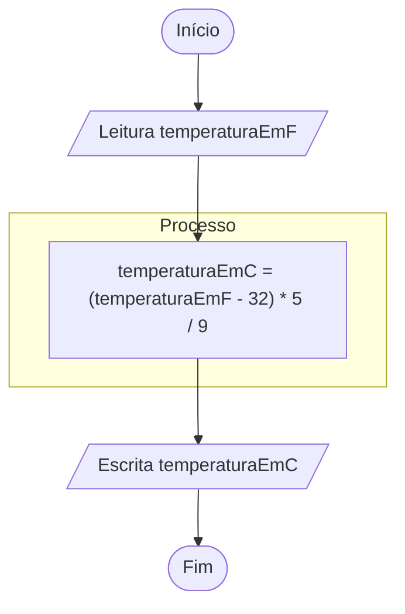

# Conversão de temperatura

Elabore um fluxograma para um algoritmo que LÊ um número real representando uma temperatura em graus Fahrenheit e ESCREVE esta temperatura em graus Celsius. Lembre-se que para converter de Fahrenheit para Celsius, basta subtrair 32 e multiplicar por 5/9. Em seguida, execute um teste de mesa com a entrada 100; a saída deve ser 37.7778.

## Fluxograma



- [Link para fluxograma no fluxolab](https://fluxolab.app/?lzs=NoIhBplAXBTBbADrATgQ2gV3QUXgMQgAYBdSEOJVDbNPAYWJLKiPAGZwAWANjYA42YcgCMA9tGhj4IZpACM4ftz7ciQiMDnAATNxVt5qigmTosuAppDjJ02S04BWAxx1DKZmpcaiJUmW0ucB5XHS4PU2oLOnh6AF4AAgAKT2jaPHwAWnYdAEpEgCpEp0SAekSATmtbAIcWYEM2HRY9eTYuFmD2jkdwHvlmEiA)

## Teste de mesa

| Bloco | instrução | temperaturaEmF | ptemperaturaEmC | Entrada | Saida
| :---: | :---: | :---: | :---: | :---: | :---:
| Bloco 0 | Início | 0 | 0 | 0 | 0
| Bloco 1 | Leia | 100 | 0 | 100 | 0
| Bloco 2 | Atribuição | 100 | 37.7778 | 0 | 0
| Bloco 3 | Escreva | 100 | 37.7778 | 0 | 37.7778
| Bloco 4 | Fim | 100 | 37.7778 | 0 | 0

### Java

```java
import java.util.Scanner;

public class ConversaoTemperatura {
    public static void main(String args[]){
        double temperaturaEmFarenheit, temperaturaEmCelsius;
        try(Scanner scanner = new Scanner(System.in)){
            System.out.print("Digite a temperatura em Fahrenheit: ");
            temperaturaEmFarenheit = scanner.nextDouble();

            temperaturaEmCelsius = (temperaturaEmFarenheit - 32) * 5/9;

            System.out.println("A temperatura em Celsius é: " + temperaturaEmCelsius);
        }catch(Exception e){
            System.out.println("Ocorreu um erro: " + e.getMessage());
        }
    }
}
```
