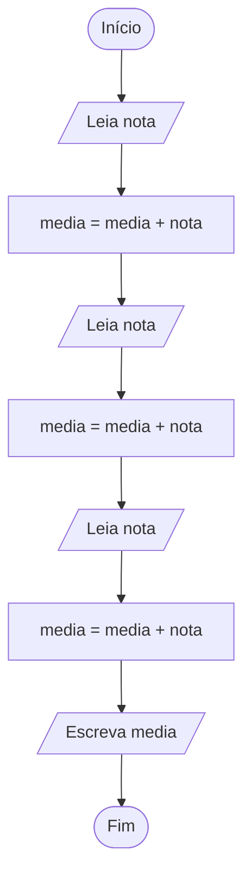

# Media das notas

Elabore um fluxograma para um algoritmo que LÊ quatro número reais representando as notas de um aluno e ESCREVE a média aritmética simples destas notas. Utilize apenas duas variáveis. Em seguida, execute um teste de mesa com a entrada 7.5 8.0 5.5 9.0; a saída deve ser 7.5.

## Fluxograma

## Teste de mesa

| Bloco | instrução | nota | media | Entrada | Saida
| :---: | :---: | :---: | :---: | :---: | :---: |
| Bloco 0 | Início | 0 | 0 | 0 | 0 |
| Bloco 1 | Leia | 7.5 | 0 | 7.5 | 0 |
| Bloco 2 | Atribuição | 7.5 | 7.5 | 0 | 0 |
| Bloco 3 | Leia | 8.0 | 7.5 | 8 | 0 |
| Bloco 2 | Atribuição | 8.0 | 15.5 | 0 | 0 |
| Bloco 3 | Leia | 5.5 | 15.5 | 5.5 | 0 |
| Bloco 2 | Atribuição | 5.5 | 21 | 0 | 0 |
| Bloco 3 | Leia | 9.0 | 21 | 9.0 | 0 |
| Bloco 2 | Atribuição | 9.0 | 30 | 0 | 0 |
| Bloco 3 | Escreva | 9.0 | 30 | 0 | 30 |
| Bloco 0 | Fim | 9.0 | 30 | 0 | 30 |