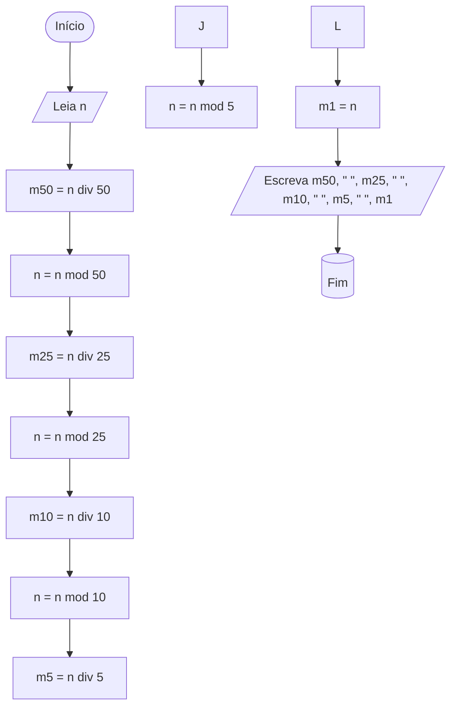

# Conversor de moedas

Elabore um fluxograma para um algoritmo que LÊ um número inteiro representando um valor em centavos e ESCREVE as moedas necessárias para formar esse valor, dando preferência para as moedas de maior valor. As moedas disponíveis são de 50, 25, 10, 5 e 1 centavo. Por exemplo, para formar 68 centavos é necessário 1 moeda de 50 centavos, 0 moedas de 25 centavos, 1 moeda de 10 centavos, 1 moeda de 5 centavos e 3 moedas de 1 centavo. Em seguida, execute um teste de mesa com a entrada 57; a saída deve ser 1 0 0 1 2.

## Fluxograma

[Link do fluxograma no fluxolab](https://fluxolab.app/?lzs=NoIhBplA7CAYC6kQFsCsd5NCgTGrZFARk3ESIPO1WK22DnAGZxcAOJ43JsZAIwD2AF2GCUIBNmLgALG05s4vWAJFiJUyLnAA2BUw690cAAQBeU9FMATAJYA3Uxgigho8ZOzz9RubON8CytbR1N8VxB3DS9IVl9FZl0VS2sUQRtnMjd1Ty1gND0DcDQecBBrVNN0zIi1D01sfQSmZONSYOt7J1JI6LzsAHYiv11FCs7qjNNe+pj89hHFQeTy9Enu5z7cxsgATiWmdgDyypCarbmByFJD8D2y2g2wuivd4GIZQr9SR5NwUwAHRAQIg1XwAOBoIBJCYoOh1UK8OBMNeOQasQ+OkWP1IvFcUgYXC40nAt1w2B0t2Y2FYt1k3jJTDQ2EKt10TSZ4EGQy57Gwi1ue2wB1upGkxLJxGkMjFFKkQA)

## Teste de mesa

| Bloco | instrução | m50 | m25 | m10 | m5 | m1 | n | Entrada | Saida
| :---: | :---: | :---: | :---: | :---: | :---: | :---: | :---: | :---: | :---: |
| Bloco 0 | Início | 0 | 0 | 0 | 0 | 0 | 0 | 0 | 0 |
| Bloco 1 | Leia | 0 | 0 | 0 | 0 | 0 | 57 | 57 | 0 |
| Bloco 2 | Atribuição | 1 | 0 | 0 | 0 | 0 | 57 | 0 | 0 |
| Bloco 3 | Atribuição | 1 | 0 | 0 | 0 | 0 | 7 | 0 | 0 |
| Bloco 4 | Atribuição | 1 | 0 | 0 | 0 | 0 | 7 | 0 | 0 |
| Bloco 5 | Atribuição | 1 | 0 | 0 | 0 | 0 | 0 | 0 | 0 |
| Bloco 6 | Atribuição | 1 | 0 | 0 | 0 | 0 | 0 | 0 | 0 |
| Bloco 7 | Atribuição | 1 | 0 | 0 | 0 | 0 | 0 | 0 | 0 |
| Bloco 8 | Atribuição | 1 | 0 | 0 | 1 | 1 | 2 | 0 | 0 |
| Bloco 9 | Atribuição | 1 | 0 | 0 | 1 | 2 | 0 | 0 | 0 |
| Bloco 10 | Atribuição | 1 | 0 | 0 | 1 | 1 | 0 | 0 | 0 |
| Bloco 11 | Escreva | 1 | 0 | 0 | 1 | 1 | 0 | 0 | 10012 |
| Bloco 12 | Fim | 1 | 0 | 0 | 1 | 1 | 0 | 0 | 0 |