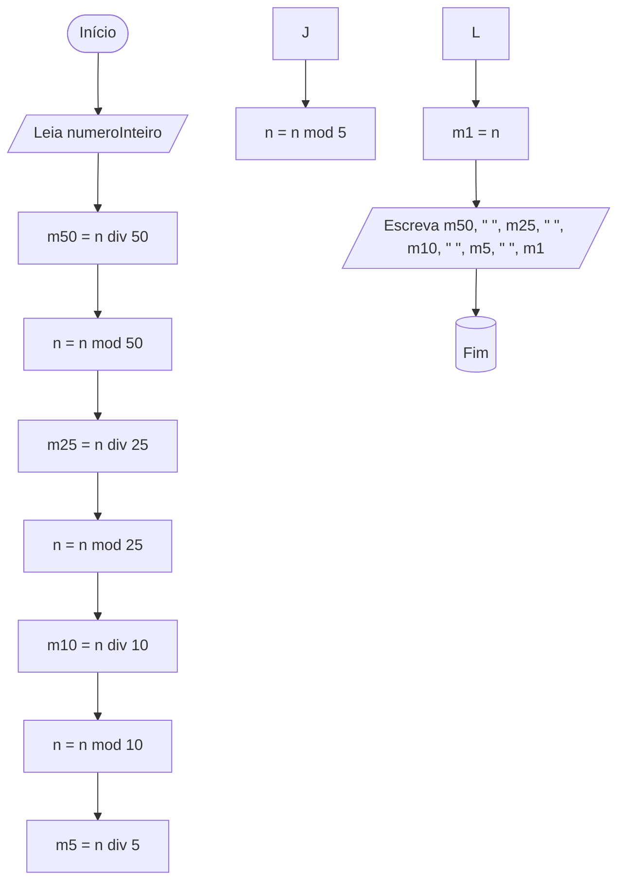

# Conversor de moedas

Elabore um fluxograma para um algoritmo que LÊ um número inteiro representando um valor em centavos e ESCREVE as moedas necessárias para formar esse valor, dando preferência para as moedas de maior valor. As moedas disponíveis são de 50, 25, 10, 5 e 1 centavo. Por exemplo, para formar 68 centavos é necessário 1 moeda de 50 centavos, 0 moedas de 25 centavos, 1 moeda de 10 centavos, 1 moeda de 5 centavos e 3 moedas de 1 centavo. Em seguida, execute um teste de mesa com a entrada 57; a saída deve ser 1 0 0 1 2.

## Fluxograma

